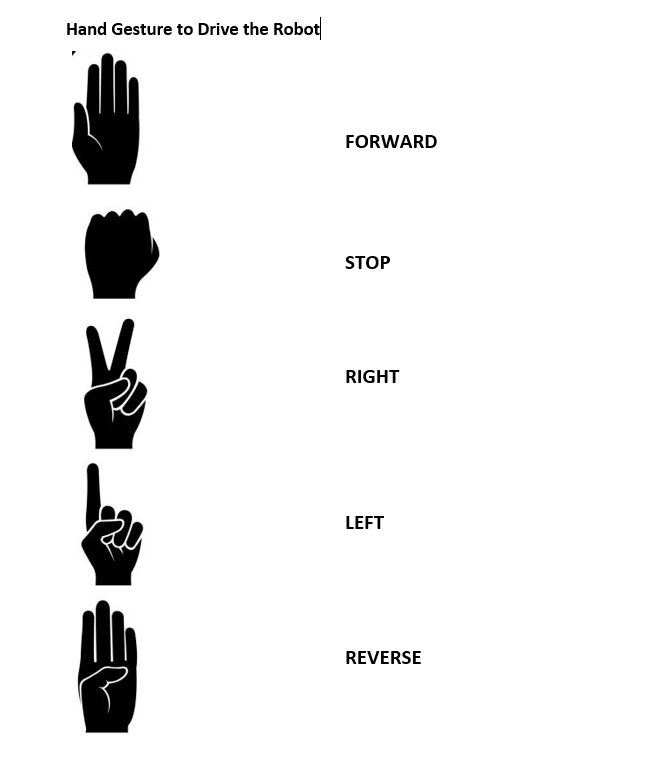

## Mobile robot control using hand gestures
This project was build to study and understand the importance of human and robot collaboration in an agriculture environment. This was a simple task of detecting and identifying human gestures using Mediapipe module and control a small robot's movement (forward,reverse, rightTurn, leftTurn, and stop).

## How to install and run the project
<!-- OL -->
1. Install anaconda on your system, if you don't already have it follow these <!-- Links --> [Instructions](https://docs.anaconda.com/free/anaconda/install/index.html).
2. Create an environment inside anaconda and activate it.
<!-- Code Blocks -->
``` bash
    conda create -n <environment_name>
    conda activate <environment_name>
```
3. Install Jupyter notebook in the environment.
<!-- Code Blocks -->
``` bash
    conda install -c anaconda ipykernel
```
4. Inside the enevironment navigate to the folder with the code and install required libraries.
<!-- Code Blocks -->
``` bash
    pip install requirements.txt
```
5. run jupyter notebook at the location of the code and inside jupyter click on Run All.
``` bash
    jupyter notebook .
    or
    jupyter notebook <path_to_the_code>
```

## Gestures and corresponding movement command
handgesture detection is based on counting how many fingers are up. This is for static hand gestures only. Below is an image showing different gestures and their corresponding mobile robot movemnt command.

<!-- Images -->


